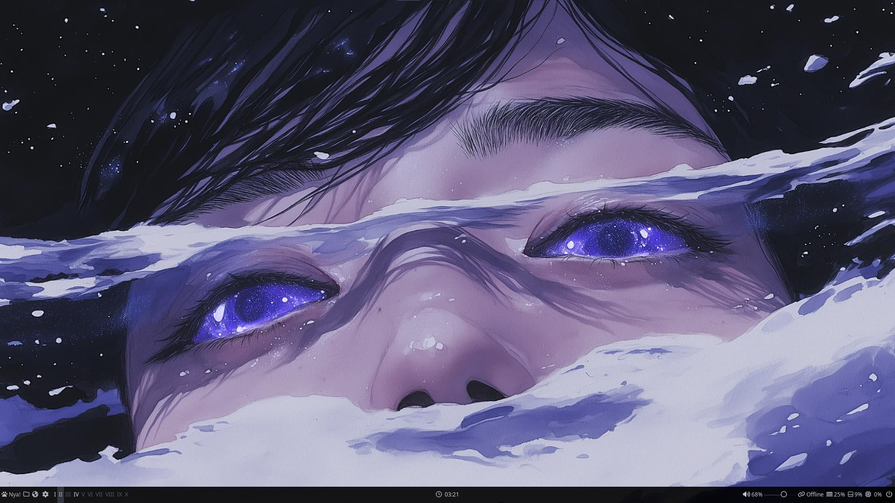
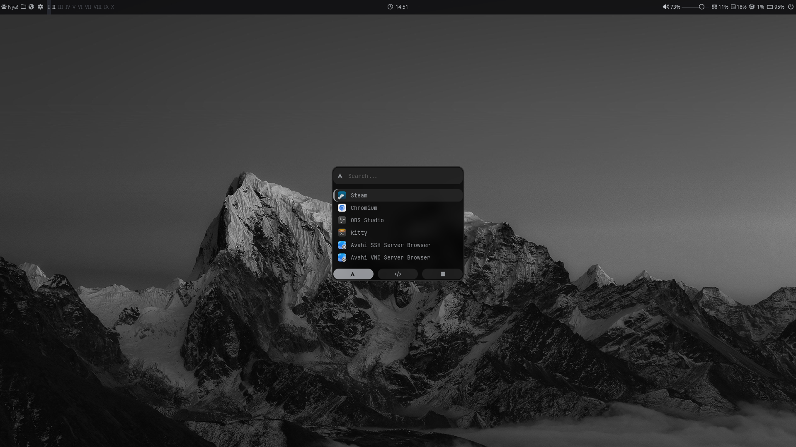
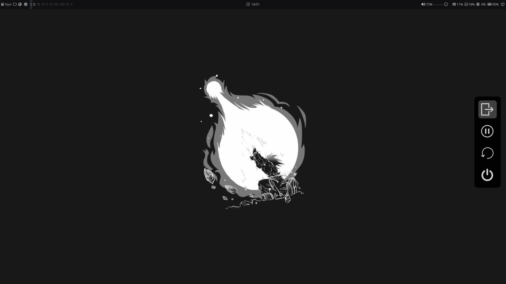
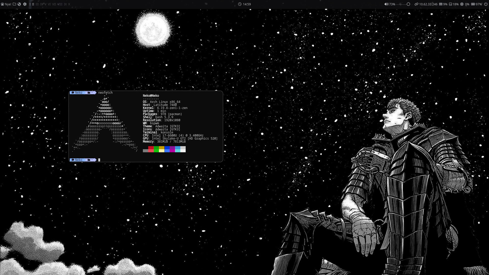

<p align="center">
  
</p>


<h1 align="center">🌑 My Dotfiles OBSIDIAN Theme</h1>
<p align="center">
  <strong>A Formal Black BSPWM Environment For Focus and Fluidity.</strong>
  <br />
  <i>Bridging the gap between X11 stability and modern Wayland Aesthetics.</i>
</p>

<p align="center">
  
  
  
</p>

## 📸 Visual Showcase

<div align="center">
  <table border="0" cellspacing="5" cellpadding="5">
    <tr>
      <td width="50%"></td>
      <td width="50%"></td>
    </tr>
    <tr>
      <td width="50%"></td>
      <td width="50%"></td>
    </tr>
  </table>
</div>

---

## 🎨 Design Philosophy
Unlike static setups, **Obsidian** treats the desktop as a living workspace. Every shadow, transition, and border is calculated to provide a high-density, professional experience.

* **Palette:** Deep Obsidian (`#000000`) paired with Crisp Slate (`#B0B3B8`).
* **Compositor:** Custom `picom` build featuring `dual_kawase` blurring and slide-in workspace transitions.
* **Typography:** `JetBrainsMono Nerd Font` for surgical technical clarity.
* 
---

## ⚙️ The Script API
This rice is driven by a suite of custom automation tools located in `.config/bspwm/`:

* **`screen.sh`**: A robust, CLI-guided display management tool with strict validation for resolution, refresh rates, and rotation.
* **`wall.sh`**: A GUI-based wallpaper engine that generates a **4x4 visual grid** using Rofi for instant theme switching.
* **`log.sh`**: A borderless, minimalist power menu using high-fidelity `.png` iconography.

---

## ⌨️ Essential Workflow
Keybindings are handled by `sxhkd`. The logic is grouped by "System", "Media", and "Navigation".

| Action | Keybinding |
| :--- | :--- |
| **Primary Terminal (Kitty)** | `Super + T` |
| **App Launcher (Rofi)** | `Super + R` |
| **Wallpaper Grid Selector** | `Super + W` |
| **Power Menu** | `Super + N` or `F10` |
| **Close Window** | `Super + Q` |
| **Toggle Floating** | `Super + Space` |
| **System Resource Monitor** | `F5` |

---

## 🔋 Modular Infrastructure
The configuration is split to support both high-end desktops and portable machines:

* **Desktop (`config.ini`)**: Optimized for static network setups and multi-monitor layouts.
* **Laptop (`configLAP.ini`)**: Features dynamic battery ramps (`` to ``) and backlight control modules.
* **Compositor**: Glx-backend optimized for NVIDIA/Intel to ensure tear-free animations.

---
## 📥 Installation

### 1. Dependencies
Ensure you have the core toolkit installed:
```bash
git clone https://github.com/NekoScripty/Dotfiles.git
&& cd Dotfiles
```
## ⚙️ Then Auto Installation Script 
```bash
sudo chmod +x DFPKGS.sh &&
bash DFPKGS.sh
```
<div align="center">
  <br>
  <i>« Stay Comfy, Stay Code »</i>
</div>
<p align="center">
  
</p>
